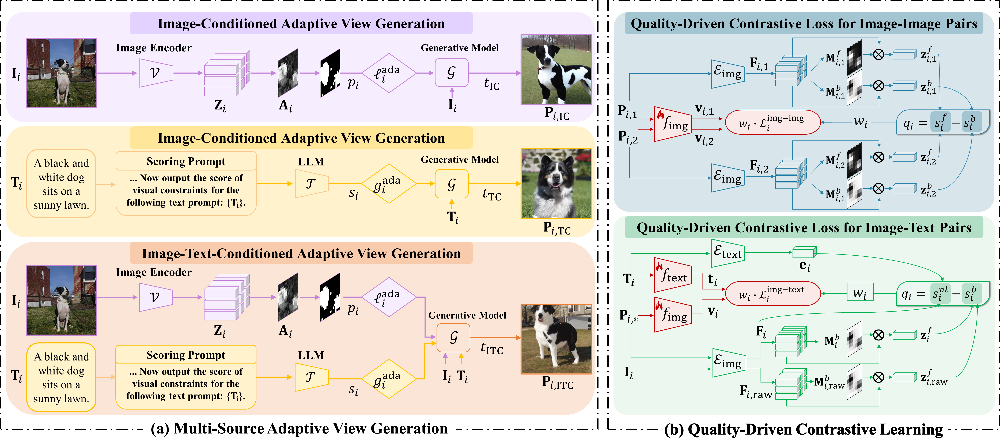

# GenView++: Unifying Adaptive View Generation and Quality-Driven Supervision for Contrastive Representation Learning



This repository contains the official implementation of **GenView++: Unifying Adaptive View Generation and Quality-Driven Supervision for Contrastive Representation Learning**,  
which serves as an extended version of our ECCV 2024 paper,  
[**GenView: Enhancing View Quality with Pretrained Generative Model for Self-Supervised Learning**](https://arxiv.org/abs/2403.12003).  
Compared to the original GenView framework, GenView++ generalizes the methodology from unimodal (vision-only) representation learning to a unified multimodal setting, introducing adaptive view generation strategies for multi-source conditions, as well as a multimodal quality-driven contrastive learning mechanism.  


> **[GenView++: Unifying Adaptive View Generation and Quality-Driven Supervision for Contrastive Representation Learning](https://arxiv.org/abs/xxx)**<br> 
> [Xiaojie Li](https://xiaojieli0903.github.io/)^1,2, [Bei Wang]^1, [Jianlong Wu](https://jlwu1992.github.io)^1,2, [Liqiang Nie](https://liqiangnie.github.io/index.html)^1, [Yue Yu](https://yuyue.github.io)^2, [Min Zhang](https://zhangminsuda.github.io)^1 <br>
> ^1 Harbin Institute of Technology (Shenzhen), China, ^2 Pengcheng Laboratory, Shenzhen, China


## 🔨 Installation

Follow the steps below to set up the environment and install dependencies.

### Step 1: Create and Activate a Conda Environment

Create a new Conda environment with Python 3.9 and activate it:

```bash
conda create --name genview python=3.9 -y
conda activate genview
```

### Step 2: Install Required Packages

You can install PyTorch, torchvision, and torchaudio via pip or Conda. Choose the command based on your preference and GPU compatibility.

```bash
# Using pip
pip install torch==2.4.1 torchvision==0.19.1 torchaudio==2.4.1 --index-url https://download.pytorch.org/whl/cu124

# Or using conda
conda install pytorch==2.4.1 torchvision==0.19.1 torchaudio==2.4.1 pytorch-cuda=12.4 -c pytorch -c nvidia
```

### Step 3: Clone the Repository and Install Project Dependencies

Clone the GenView repository and install the required dependencies:

```bash
git clone https://github.com/xiaojieli0903/GenViewPlusPlus.git
cd GenViewPlusPlus
pip install -r requirements.txt
```

Apply modifications to `open_clip` and `timm`:

```bash
sh modifications/change_openclip_timm.sh
```

## 📷 Adaptive View Generation

### **Step 1: calculate the noise level and guidance scale of each original image**

#### **1.1 Calculate Noise Level**

We utilize the pretrained **CLIP ViT-H/14** backbone, which serves as the conditional image encoder in **Stable UnCLIP v2-1**, to determine the proportion of foreground content before image generation. This backbone processes an input resolution of \(224 \times 224\) and generates 256 tokens, each with a dimension of 1280. 

For calculating PCA features needed for foreground-background separation, we randomly sample 10,000 images from the original dataset. The threshold \( \alpha \) in Equation (7) is selected to ensure that foreground tokens account for approximately 40% of the total tokens, providing a clear separation between foreground and background.

##### **1.1.1: Extract CLIP Image Features and Compute PCA**

We first extract features from 10,000 images using the CLIP ViT-H/14 backbone and then perform PCA analysis.
The calculated PCA vectors act as classifiers for distinguishing between foreground and background regions.

**Command to Extract Features and Perform PCA Analysis:**

```shell
python data_generation/adaptive_noise_level/extract_features_pca.py \
    --input-list data/CC3M/cc3m_sampled_10000pair.csv \
    --num-extract 10000 \
    --patch-size 14 \
    --num-vis 20 \
    --model ViT-H-14 \
    --training-data laion2b_s32b_b79k
```

- `--input-list`: Path to the file containing the list of sampled images (`data/CC3M/cc3m_sampled_10000pair.csv`).
- `--num-extract 10000`: Specifies the number of images to process.
- `--patch-size 14`: Patch size used by the model.
- `--num-vis 20`: Number of images to visualize.
- `--model ViT-H-14`: Specifies the CLIP model to use.
- `--training-data laion2b_s32b_b79k`: Pretrained weights for the model.

**Outputs:**

- **Extracted Features**: Saved in the `features/` directory.
- **PCA Eigenvectors**: Saved in the `eigenvecters/` directory.
- **Generated Masks, Maps, and Original Images**: Saved in the `masks/`, `maps/`, and `original_images/` directories, respectively.
- **Threshold for Foreground-Background Separation**: During the PCA analysis, a background threshold is also calculated and used for generating masks. This threshold helps to separate foreground from background regions by comparing the PCA-transformed feature values with the threshold. The resulting masks can then be used to compute the foreground ratio for each image in the next steps.

##### **1.1.2 Extract Features for the Entire Dataset**

First, we need to extract features for each image in the dataset. This process may take around 4 hours with a batch size of 1024, and the extracted features will require approximately 4GB of storage.

**Command to Extract Features:**

```shell

python data_generation/adaptive_noise_level/extract_features_pca.py \
    --input-list data/CC3M/paris.csv \
    --num-extract -1 \
    --patch-size 14 \
    --num-vis 20 \
    --model ViT-H-14 \
    --training-data laion2b_s32b_b79k
```

- `--input-list`: Path to the file containing the list of all training images.
- `--num-extract -1`: Processes all images in the list (no limit).
- Other parameters are the same as in Step 1.

##### **1.1.3 Calculate Foreground Ratios**

Using the previously computed PCA vectors and the foreground-background threshold (`fg_thre`), we calculate the foreground ratio (`fg_ratio`) for each image in the dataset. The `fg_ratio` helps quantify the proportion of foreground content within each image, which will later guide noise level determination for adaptive view generation.

**Command to Calculate `fg_ratio`**:

```shell
python data_generation/adaptive_noise_level/calculate_fgratio.py \
    --input-dir data/pca_results/ViT-H-14-laion2b_s32b_b79k/ \
    --input-list data/CC3M/pairs.csv \
    --output-dir data/CC3M/ \
    --fg-thre {computed_threshold} \
    --mask-type {gt_or_lt}
```
- `--input-dir`: Path to the directory to save extracted features and PCA eigenvecters.
- `--input-list`: Path to the file containing the list of all training images.
- `--output-dir`: Directory where the `fg_ratios.csv` file will be saved.
- `--fg-thre {computed_threshold}`: The foreground-background threshold value (`fg_thre`) calculated from **Step 1** using PCA analysis. This threshold ensures the proper separation of foreground and background regions.
- `--mask-type {gt_or_lt}`: Determines whether greater-than (gt) or less-than (lt) the threshold should be classified as foreground. Use --mask-type lt if black = foreground, or --mask-type gt if white = foreground, based on the masks saved in masks/ and the corresponding reference images in original_images/.

A file named `fg_ratios.csv` will be generated in the specified output directory. This file contains a list of image paths paired with their respective `fg_ratio` values (and prompts).
  
##### **1.1.4 Generate Adaptive Noise Levels**

Finally, we convert the original `fg_ratios.csv` into a single CSV file with adaptive noise levels.
Each entry in the output file contains three fields: image, prompt, noise_level.
**Command to Generate Noise Level Files:**

```shell
python data_generation/adaptive_noise_level/generate_ada_noise_level.py \
    --input-file data/CC3M/fg_ratios.csv \
    --output-dir data/CC3M/
```

- `--input-file`: Path to the `fg_ratios.csv` generated in the previous step.
- `--output-dir`: Directory where the noise level files will be saved.

These files categorize images based on their foreground ratios, allowing us to assign appropriate noise levels during image generation to achieve the desired balance between semantic consistency and diversity.

#### **1.2 Calculate Guidance Scale**

To determine the **guidance scale** for each image, we provide a script (`data_generation/adaptive_guidance_scale/score.py`) that computes guidance scores using a pretrained model (e.g., `deepseek`).  
The script supports both **multi-GPU** and **single-GPU** execution for flexible usage.

##### **Multi-GPU Example**

```bash
CUDA_DEVICES="0,1,2,3,4,5,6,7"
IFS=',' read -r -a GPU_LIST <<< "$CUDA_DEVICES"
NUM_GPUS=${#GPU_LIST[@]}

echo "Using GPUs: ${GPU_LIST[*]} for parallel processing."

for ((i=0; i<$NUM_GPUS; i++))
do
    GPU_ID=${GPU_LIST[i]}
    echo "Starting process on GPU $GPU_ID..."
    CUDA_VISIBLE_DEVICES=$GPU_ID python data_generation/adaptive_guidance_scale/score.py \
        --input_csv INPUT_CSV   \ # Enter the path of input file name here
        --output_csv OUTPUT_CSV \ # Enter the path of output file name here
        --model_name MODEL_NAME \ # Enter the model name (e.g.'deepseek') for evaluation here 
        --gpu_rank $i \
        --n_gpus $NUM_GPUS &
done

wait
echo "All GPU processes finished!"
```

##### **Single-GPU Example**

```bash
CUDA_VISIBLE_DEVICES=0 python data_generation/adaptive_guidance_scale/score.py \
        --input_csv INPUT_CSV   \ # Enter the path of input file name here
        --output_csv OUTPUT_CSV \ # Enter the path of output file name here
        --model_name MODEL_NAME \ # Enter the model name (e.g.'deepseek') for evaluation here 
        --gpu_rank 0 --n_gpus 1
```

### **Step 2: merge the noise level and guidance scale if needed**
```bash
python data_generation/merge.py \
    --csv_gs data/CC3M/guidance_scale.csv \
    --csv_nl data/CC3M/noise_level.csv \
    --output_dir data/CC3M/
```

### **Step 3: adaptive generation**

We provide ready-to-use scripts (scripts/gen_multi.sh and scripts/gen_single.sh) for adaptive generation. You can launch either **multi-GPU** or **single-GPU** runs depending on your setup.

#### **Important Arguments in `generate.py`**
| Argument | Type | Default | Description |
|----------|------|---------|-------------|
| `--outdir` | `str` | `data/outputs` | Directory where generated images will be saved. |
| `--conditioned_mode` | `str` | `imgtxt` | Conditioning mode: <br>• `txt`: text only <br>• `img`: image only <br>• `imgtxt`: image + text |
| `--guidance_scale` | `float` | `10` | Guidance scale for classifier-free guidance (only for IC mode). Higher values enforce stronger text alignment. |
| `--noise_level` | `int` | `100` | Noise level for image perturbation (only for TC mode). Controls diversity of generations. |
| `--batch_size` | `int` | `1` | Number of samples processed per GPU step. |
| `--from_file` | `str` | `None` | Path to a CSV file containing generation info (e.g., image path, prompt, etc.). |
| `--root_path` | `str` | `None` | Root path to the original dataset (required for image-conditioned mode). |
| `--n_samples` | `int` | `1` | Number of samples to generate per condition. |
| `--img_save_size` | `int` | `256` | Resolution of saved images. |

## 🔍 Quality-Driven Contrastive Loss

We use the pretrained CLIP ConvNext-Base model as the encoder to extract feature maps from augmented positive views. These feature maps, with a resolution of 7² from a 224² input, are used to calculate foreground and background attention maps based on PCA.

We randomly sample 10,000 images to compute PCA features. The threshold \( \alpha \) ensures that 40% of the tokens represent the foreground, enabling clear separation.

Use the following command to extract features and compute PCA:

```bash
python data_generation/adaptive_noise_level/extract_features_pca.py \
    --input-list data/CC3M/cc3m_sampled_10000pair.csv \
    --num-extract 10000 \
    --patch-size 32 \
    --num-vis 20 \
    --model convnext_base_w \
    --training-data laion2b-s13b-b82k-augreg
```
### Outputs

- **Extracted Features**: Stored in `features/`.
- **PCA Eigenvectors**: Stored in `eigenvectors/`.
- **Masks, Maps, and Original Images**: Stored in `masks/`, `maps/`,git  and `original_images/`.

These PCA vectors are used to generate foreground and background attention maps during pretraining. We provide precomputed PCA vectors, which can be found at `data_generation/adaptive_noise_level/clip_pca/pca_results/convnext_base_w_laion2b-s13k-b82k-augreg/eigenvectors/pca_vectors.npy`

## 🔄 Training

Example Training Command and Explanation of Some Parameters are as follows:

```bash
torchrun --nproc_per_node=4 --nnodes=1 \
  --node_rank=0 --master_port=50000 \
  train.py \
    --model base \
    --batch_size 64 \
    --epochs 25 --warmup_epochs 2 \
    --output_dir output --log_dir output \
    --csv_path /data/CC3M/cc3m.csv --syn_csv_path /data/CC3M/cc3m.csv \
    --folder_list \
      /data/CC3M/raw \
      /data/CC3M/output/txt_scale-ada_noise100_times1_seed42 \
      /data/CC3M/output/img_scale10.0_noise-ada_times1_seed42 \
      /data/CC3M/output/imgtxt_scale-ada_noise-ada_times1_seed42 \
    --folder_suffix_list .jpg .jpg .jpg .jpg \
    --real_images_path_suffix data/CC3M/raw .jpg \
    --n_img 4 --syn_idx_list 1 2 3 --syn_ratio 1.0 \
    --early_loss_coefs 1 0 1 0 --later_loss_coefs 1 1 1 1
```

### Data-related Parameters:
- **`--csv_path`**: Specifies the path to the CSV file containing the dataset for training.
- **`--syn_csv_path`**: Specifies the path to the CSV file for the synthetic dataset used in training.
- **`--folder_list`**: Lists the directories containing images from different sources.
- **`--folder_suffix_list`**: Specifies the file extensions of images in the directories listed in `--folder_list` (default is `.jpg`).
- **`--real_images_path_suffix`**: Specifies the path and file extension for real images (default is `'data/CC3M/raw'` and `.jpg`).
- **`--n_img`**: Defines the number of images to be used for each training sample (in this case, 4 images).
- **`--syn_idx_list`**: Specifies the list of indices for the synthetic datasets to be used (in this case, datasets 1, 2, and 3, without 0).
- **`--syn_ratio`**: Sets the ratio of synthetic data to be used in training (in this case, 1.0, meaning 100% synthetic data).

### Loss-related Parameters:
- **`--epoch_switch`**: Specifies the epoch at which the loss weight changes between two stages of training. The `epoch` variable ranges from 0 to the actual number of epochs minus one. When `epoch == args.epoch_switch`, the loss weights will switch to the values defined in `--later_loss_coefs`.
- **`--early_loss_coefs`**: Defines the loss weights for the early stage of training (before `epoch == args.epoch_switch`). The 4 values correspond to the following losses:
  - **img-img loss**: Weight for the image-to-image loss.
  - **img-img loss with QD**: Weight for the image-to-image loss with Quality-Driven supervision.
  - **img-txt loss**: Weight for the image-to-text loss.
  - **img-txt loss with QD**: Weight for the image-to-text loss with Quality-Driven supervision.
- **`--later_loss_coefs`**: Defines the loss weights for the later stage of training (after `epoch == args.epoch_switch`). These weights also correspond to the same 4 types of losses:
  - **img-img loss**: Weight for the image-to-image loss.
  - **img-img loss with QD**: Weight for the image-to-image loss with Quality-Driven supervision.
  - **img-txt loss**: Weight for the image-to-text loss.
  - **img-txt loss with QD**: Weight for the image-to-text loss with Quality-Driven supervision.
- **`--gamma_ii`**: Controls sensitivity for scaling image-to-image loss with QD (default is 2).
- **`--gamma_it`**: Controls sensitivity for scaling image-to-text loss with QD (default is 2).
- **`--standard_array_path`**: Path to store PCA feature values used in quality-driven learning.


## Downsteam Tasks
### Linear Probe
After pretraining, we evaluate the learned representations via linear probing on a range of downstream datasets.
We provide a bash script to launch linear probe experiments in parallel on different datasets with flexible GPU assignment.
```bash
# Pretrained model checkpoint
work_dir=""
epochs=90
model="base"
pretrained="$work_dir/epoch_last.pth"

# Task configuration:
# enable | dataset | gpus     | batch_size | drop_last | use_bn
TASK_CONFIGS=(
  "0    in1k        0,1,2,3,4,5,6,7 256       1           0"
  "0    cifar10     0,1             256       1           0"
  "0    in100       2,3             256       1           0"
  "0    cifar100    2,3             256       1           0"
  "0    dtd         2               64        0           0"
  "0    flowers     4               64        0           0"
  "0    food101     5,6             256       1           0"
  "0    sun397      4               256       1           0"
  "0    aircraft    7               128       0           0"
  "1    pets        7               128       0           0"
  "1    caltech101  1               128       0           0"
)

base_port=60000
index=0

for config in "${TASK_CONFIGS[@]}"; do
  read -r enable task gpus batch_size drop_last use_bn <<< "$config"

  if [ "$enable" -ne 1 ]; then
    echo "Skipping $task"
    ((index++))
    continue
  fi

  echo "Launching $task on GPUs $gpus"

  num_gpu=$(echo "$gpus" | awk -F',' '{print NF}')
  port=$((base_port + index))
  linear_dir="linear_${task}_${num_gpu}xb${batch_size}_${epochs}e"

  cmd="CUDA_VISIBLE_DEVICES=$gpus torchrun --nproc_per_node=$num_gpu \
    --nnodes=1 --node_rank=0 --master_port=$port \
    linear.py --model $model --epochs $epochs \
    --pretrained $pretrained \
    --output-dir $work_dir/$linear_dir \
    --dataset $task \
    --batch-size $batch_size"

  if [ "$drop_last" -eq 1 ]; then
    cmd="$cmd --drop_last"
  fi
  if [ "$use_bn" -eq 1 ]; then
    cmd="$cmd --use_bn"
  fi

  eval "$cmd &"

  ((index++))
done

wait
```

### Other Tasks (Zero-shot Classification & Retrieval)
For other evaluation tasks such as zero-shot classification and zero-shot retrieval, we leverage the [CLIP_benchmark](https://github.com/LAION-AI/CLIP_benchmark).
This library provides a unified interface to evaluate vision-language models on a wide range of benchmarks. We use it to measure our pretrained model’s generalization ability without further fine-tuning.
👉 Note: The specific modifications required to integrate our method into the CLIP_benchmark library will be released shortly.

## Model Weights
The pre-trained weights used in this paper are not yet released.  
They will be updated and shared in this repository soon. Stay tuned!
