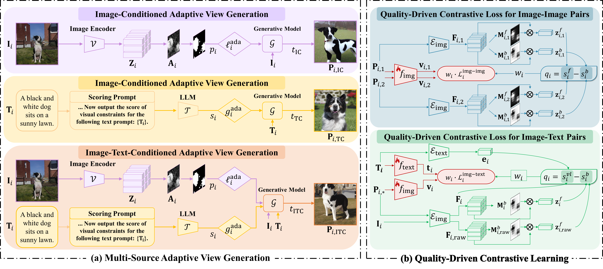

# GenView++: Adaptive View Generation and Quality-Driven Supervision for Vision and Vision-Language Representation Learning



This repository contains the official implementation of **GenView++: Adaptive View Generation and Quality-Driven Supervision for Vision and Vision-Language Representation Learning**, presented at ECCV 2024.

> **[GenView++: Adaptive View Generation and Quality-Driven Supervision for Vision and Vision-Language Representation Learning](https://arxiv.org/abs/xxx)**<br> 

## 🔨 Installation

Follow the steps below to set up the environment and install dependencies.

### Step 1: Create and Activate a Conda Environment

Create a new Conda environment with Python 3.9 and activate it:

```bash
conda create --name env_genview python=3.9 -y
conda activate env_genview
```

### Step 2: Install Required Packages

You can install PyTorch, torchvision, and torchaudio via pip or Conda. Choose the command based on your preference and GPU compatibility.

```bash
# Using pip
pip install torch==2.4.1 torchvision==0.19.1 torchaudio==2.4.1 --index-url https://download.pytorch.org/whl/cu124

# Or using conda
conda install pytorch==2.4.1 torchvision==0.19.1 torchaudio==2.4.1 pytorch-cuda=12.4 -c pytorch -c nvidia
```

### Step 3: Clone the Repository and Install Project Dependencies

Clone the GenView repository and install the required dependencies:

```bash
git clone https://github.com/xiaojieli0903/GenViewPlusPlus.git
cd GenViewPlusPlus
pip install -r requirements.txt
```

Apply modifications to `open_clip` and `timm`:

```bash
sh data_generation/adaptive_noise_level/toolbox_genview/change_openclip_timm.sh
```

## 📷 Adaptive View Generation

### **Step 1: calculate the noise level and guidance scale of each original image**

#### **1.1 Calculate Noise Level**

We utilize the pretrained **CLIP ViT-H/14** backbone, which serves as the conditional image encoder in **Stable UnCLIP v2-1**, to determine the proportion of foreground content before image generation. This backbone processes an input resolution of \(224 \times 224\) and generates 256 tokens, each with a dimension of 1280. 

For calculating PCA features needed for foreground-background separation, we randomly sample 10,000 images from the original dataset. The threshold \( \alpha \) in Equation (7) is selected to ensure that foreground tokens account for approximately 40% of the total tokens, providing a clear separation between foreground and background.

##### **1.1.1: Extract CLIP Image Features and Compute PCA**

We first extract features from 10,000 images using the CLIP ViT-H/14 backbone and then perform PCA analysis.
The calculated PCA vectors act as classifiers for distinguishing between foreground and background regions.

**Command to Extract Features and Perform PCA Analysis:**

```shell
python data_generation/adaptive_noise_level/clip_pca/extract_features_pca.py \
    --input-list data_generation/adaptive_noise_level/clip_pca/cc3m_sampled_10000img.txt \
    --num-extract 10000 \
    --patch-size 14 \
    --num-vis 20 \
    --model ViT-H-14 \
    --training-data laion2b_s32b_b79k
```

- `--input-list`: Path to the file containing the list of sampled images (`data_generation/adaptive_noise_level/clip_pca/train_sampled_1000cls_10img.txt`).
- `--num-extract 10000`: Specifies the number of images to process.
- `--patch-size 14`: Patch size used by the model.
- `--num-vis 20`: Number of images to visualize.
- `--model ViT-H-14`: Specifies the CLIP model to use.
- `--training-data laion2b_s32b_b79k`: Pretrained weights for the model.

**Outputs:**

- **Extracted Features**: Saved in the `features/` directory.
- **PCA Eigenvectors**: Saved in the `eigenvecters/` directory.
- **Generated Masks, Maps, and Original Images**: Saved in the `masks/`, `maps/`, and `original_images/` directories, respectively.
- **Threshold for Foreground-Background Separation**: During the PCA analysis, a background threshold is also calculated and used for generating masks. This threshold helps to separate foreground from background regions by comparing the PCA-transformed feature values with the threshold. The resulting masks can then be used to compute the foreground ratio for each image in the next steps.

##### **1.1.2 Extract Features for the Entire Dataset**

First, we need to extract features for each image in the dataset. This process may take around 4 hours with a batch size of 1024, and the extracted features will require approximately 4GB of storage.

**Command to Extract Features:**

```shell
python data_generation/adaptive_noise_level/clip_pca/extract_features_pca.py \
    --input-list data/CC3M/image_paths.txt \
    --num-extract -1 \
    --patch-size 14 \
    --num-vis 20 \
    --model ViT-H-14 \
    --training-data laion2b_s32b_b79k
```

- `--input-list`: Path to the file containing the list of all training images.
- `--num-extract -1`: Processes all images in the list (no limit).
- Other parameters are the same as in Step 1.

##### **1.1.3 Calculate Foreground Ratios**

Using the previously computed PCA vectors and the foreground-background threshold (`fg_thre`), we calculate the foreground ratio (`fg_ratio`) for each image in the dataset. The `fg_ratio` helps quantify the proportion of foreground content within each image, which will later guide noise level determination for adaptive view generation.

**Command to Calculate `fg_ratio`**:

```shell
python data_generation/adaptive_noise_level/clip_pca/calculate_fgratio.py \
    --input-dir data_generation/adaptive_noise_level/clip_pca/pca_results/ViT-H-14-laion2b_s32b_b79k/ \
    --input-list data/CC3M/image_paths.txt \
    --output-dir data/CC3M/ \
    --fg-thre {computed_threshold} \
    --mask-type {gt_or_lt}
```
- `--input-dir`: Path to the directory to save extracted features and PCA eigenvecters.
- `--input-list`: Path to the file containing the list of all training images.
- `--output-dir`: Directory where the `fg_ratios.txt` file will be saved.
- `--fg-thre {computed_threshold}`: The foreground-background threshold value (`fg_thre`) calculated from **Step 1** using PCA analysis. This threshold ensures the proper separation of foreground and background regions.
- `--mask-type {gt_or_lt}`: Determines whether greater-than (gt) or less-than (lt) the threshold should be classified as foreground. Use --mask-type lt if black = foreground, or --mask-type gt if white = foreground, based on the masks saved in masks/ and the corresponding reference images in original_images/.

A file named `fg_ratios.txt` will be generated in the specified output directory. This file contains a list of image paths paired with their respective `fg_ratio` values.  
Each line of `fg_ratios.txt` is structured as:  
    ```
    <image_path> <fg_ratio>
    ```
    Example:  
    ```
    data/CC3M/img_0001.jpg 0.42
    data/CC3M/img_0002.jpg 0.38
    ```
  
##### **1.1.4 Generate Adaptive Noise Levels**

Finally, we distribute the original `fg_ratios.txt` entries into separate files based on specified ranges and mapping values. Each output file is named after its corresponding mapped noise level value (e.g., `fg_ratios_0.txt`, `fg_ratios_100.txt`, etc.), containing image paths and their `fg_ratio` values that fall into the respective ranges.

**Command to Generate Noise Level Files:**

```shell
python data_generation/adaptive_noise_level/clip_pca/generate_ada_noise_level.py \
    --input-file data/CC3M/fg_ratios.txt \
    --output-dir data/CC3M/
```

- `--input-file`: Path to the `fg_ratios.txt` generated in the previous step.
- `--output-dir`: Directory where the noise level files will be saved.

These files categorize images based on their foreground ratios, allowing us to assign appropriate noise levels during image generation to achieve the desired balance between semantic consistency and diversity.
    ```

#### **1.2 Calculate Guidance Scale**


### **Step 2: adaptive generation**

We provide ready-to-use commands for adaptive generation. You can launch either **multi-GPU** or **single-GPU** runs depending on your setup.

#### Multi-GPU example
```bash
node_idx=0          # index of this computing node (useful for multi-node training)
n_nodes=1           # total number of nodes
gpu_list=(0 1 2 3)  # list of GPUs to use
n_gpus=${#gpu_list[@]}  # number of GPUs

for ((i=0;i<$n_gpus;i++)); do
    export CUDA_VISIBLE_DEVICES=${gpu_list[i]}
    --outdir /path/to/output/dir \                  # Directory to save generated images
        --conditioned_mode 'txt' \                  # Conditioning type: 'txt', 'img', or 'imgtxt'
        --scale 7.5 \                               # Guidance scale for classifier-free guidance
        --batch_size 1 \                            # Number of samples processed per GPU step
        --from_file /path/to/input/prompts.csv \    # CSV file containing metadata including prompts
        --root_path /path/to/images \               # Path to original dataset (for image-conditioned mode)
        --gpu_idx $i \                              # Index of GPU in current node
        --n_gpus $n_gpus \                          # Number of GPUs per node
        --node_idx $node_idx \                      # Node index (for multi-node training)
        --n_nodes $n_nodes \                        # Total number of nodes
        --n_samples 1 \                             # Number of samples to generate per condaition
        --img_save_size 512 &                       # Resolution of generated images
done
```

#### Single-GPU example

```bash
node_idx=0
n_nodes=1
n_gpus=1
export CUDA_VISIBLE_DEVICES=0   # Use GPU 0

python txt2img_ours_v2.py \
    --outdir /path/to/output/dir \           # Directory to save generated images
    --conditioned_mode 'imgtxt' \            # Conditioning mode (image + text)
    --scale 5.0 \                            # Guidance scale
    --batch_size 1 \                         # Samples per step
    --from_file /path/to/input.csv \         # Input CSV with prompts and/or image paths
    --root_path /path/to/raw/images \        # Path to dataset
    --noise_level 0 \                        # Noise level for image-conditioned generation
    --gpu_idx 0 \                            # Index of the GPU used
    --n_gpus $n_gpus \                       # Number of GPUs (1 here)
    --node_idx $node_idx \                   # Node index
    --n_nodes $n_nodes \                     # Total nodes
    --n_samples 2 \                          # Number of samples per input
    --img_save_size 512                      # Final image resolution
```


## 🔍 Quality-Driven Contrastive Loss

We use the pretrained CLIP ConvNext-Base model as the encoder to extract feature maps from augmented positive views. These feature maps, with a resolution of 7² from a 224² input, are used to calculate foreground and background attention maps based on PCA.

We randomly sample 10,000 images to compute PCA features. The threshold \( \alpha \) ensures that 40% of the tokens represent the foreground, enabling clear separation.

Use the following command to extract features and compute PCA:

```bash
python data_generation/adaptive_noise_level/clip_pca/extract_features_pca.py \
    --input-list data_generation/adaptive_noise_level/clip_pca/train_sampled_1000cls_10img.txt \
    --num-extract 10000 \
    --patch-size 32 \
    --num-vis 20 \
    --model convnext_base_w \
    --training-data laion2b-s13b-b82k-augreg

### Outputs

- **Extracted Features**: Stored in `features/`.
- **PCA Eigenvectors**: Stored in `eigenvectors/`.
- **Masks, Maps, and Original Images**: Stored in `masks/`, `maps/`, and `original_images/`.

These PCA vectors are used to generate foreground and background attention maps during pretraining. We provide precomputed PCA vectors, which can be found at `data_generation/adaptive_noise_level/clip_pca/pca_results/convnext_base_w_laion2b-s13k-b82k-augreg/eigenvectors/pca_vectors.npy`

## 🔄 Training

TODO：修改本地参数；解释参数

torchrun --nproc_per_node=4 --nnodes=1 \
  --node_rank=0 --master_port=20001 \
  main_stablerep.py \
    --model base \
    --batch_size 64 \
    --epochs 25 --warmup_epochs 2 \
    --blr 2.0e-4 --weight_decay 0.1 --beta1 0.9 --beta2 0.98 \
    --num_workers 8 \
    --output_dir ./output/100w-50wSyn/real-txt-img-imgtxt-Ada_QD-16e-gamma2-1-1-1-1_25e \
    --log_dir ./output/100w-50wSyn/real-txt-img-imgtxt-Ada_QD-16e-gamma2-1-1-1-1_25e \
    --csv_path /data1/datasets/CC3M/cc3m_100w_relative.csv \
    --folder_list /data1/datasets/CC3M/raw \
                  /data3/datasets/CC3M/txt_scale-ada_noise100_times1 \
                  /data3/datasets/CC3M/img_scale10.0_noise-ada_times1 \
                  /data3/datasets/CC3M/imgtxt_scale-ada_noise-ada_times1 \
    --folder_suffix_list .jpg .jpg .jpg .jpg \
    --real_images_path_suffix /data1/datasets/CC3M/raw .jpg \
    --n_img 4 --downsample --downsample_prob 0.05 --down_res 64 128 \
    --syn_idx_list 1 2 3 --syn_ratio 1.0 \
    --syn_csv_path /data1/datasets/CC3M/cc3m_50w_relative.csv \
    --gamma 2 --epoch_switch 16 \
    --early_loss_coefs 1 0 1 0 --later_loss_coefs 1 1 1 1 \
